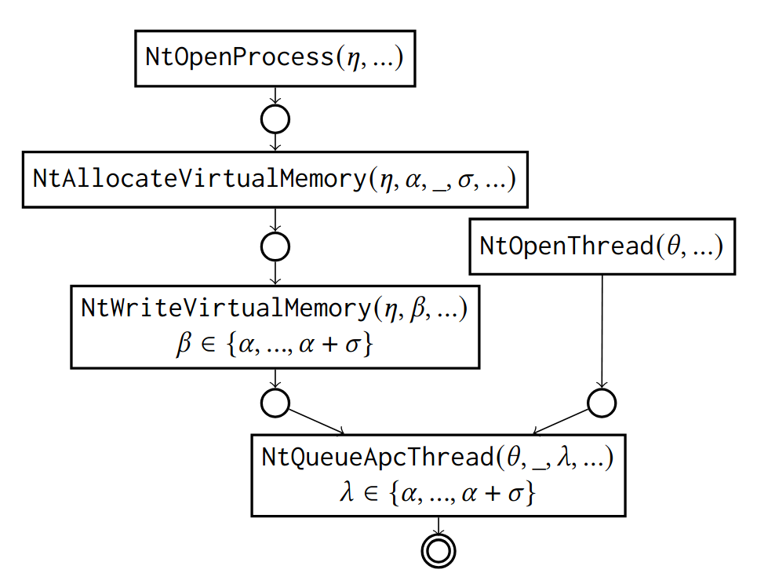

# Behavior Nets

Behavior Nets are a reusable, context-aware modeling language that expresses malicious software behavior in observable events and their
general interdependence.
They are a derivative of Petri nets that are specifically designed to recognize behavior in event streams (e.g., execution traces, syscall traces or audit logs), even if the behavior manifests in events that are typically used in a benign context or by background processes.

<div style="text-align: center;">
    
</div>

Behavior Nets are easy to create yourself, thanks to its DSL featuring pattern matching syntax and DOT-like notation.
Check out the quick starters guides ([DSL](#quick-starters-guide-dsl), [C#](#quick-starters-guide-c), [CLI](#quick-starters-guide-cli)).


## Binaries

Stable Builds:
- [GitHub Releases](https://github.com/utwente-scs/behavior-net/releases)
- NuGet Feed (coming soon!)


## Citation

If you use Behavior Nets in your research, please consider citing one of our papers:

-   [TOPS '25 journal paper](https://doi.org/10.1145/3729228):
    ```bibtex
    @article{starink2025:behavior-nets,
        author = {Starink, Jerre and Huisman, Marieke and Peter, Andreas and Continella, Andrea},
        title = {Behavior Nets: Context-Aware Behavior Modeling for Code Injection-Based Windows Malware},
        journal = {ACM Transactions on Privacy and Security (TOPS)},
        year = {2025},
        doi = {10.1145/3729228},
    }
    ```

-   Original [SecureComm '23 conference paper](https://research.utwente.nl/files/351183631/starink-codeinjection-2023.pdf) and accompanied [repository with evaluation data](https://github.com/utwente-scs/code-injection-malware):
    ```bibtex
    @inproceedings{starink2023:code-injection,
        title={Understanding and Measuring Inter-Process Code Injection in Windows Malware},
        author={Starink, Jerre and Huisman, Marieke and Peter, Andreas and Continella, Andrea},
        booktitle = {Proceedings of the International Conference on Security and Privacy in Communication Systems (SecureComm)},
        year = {2023}
    }
    ```

## Repository Organization

The repository is structured in the following manner:
- `src/lib`: Reusable core libraries.
    - `BehaviorNets.Core`: Models and evaluators for Behavior Nets.
    - `BehaviorNets.Parser`: Auxiliary library for parsing the Behavior Net DSL.
- `src/frontends`: Reference user-interfaces.
    - `BehaviorNets.CLI`: Main commandline interface for running and analyzing samples.
    - `BehaviorNets.ZipPackager`: Auxiliary tool to package software and its dependencies into a single self-extracting executable.
    - `BehaviorNets.ZipRunner`: The source code for the self-extracting executable.
- `src/drivers`: Reference backend drivers interpreting logs from sandboxes/tracers/auditers.
    - `BehaviorNets.Drivers.Drakvuf`: Driver for the [DRAKVUF sandbox](https://github.com/CERT-Polska/drakvuf-sandbox).
- `test/`: Unit tests


## Compiling

1. Ensure you have .NET 8.0 or higher installed. See [official installation instructions](https://dotnet.microsoft.com/en-us/download/dotnet/6.0).

2. Build using your favorite IDE such as Visual Studio or JetBrains Rider, or run the following command:

    ```
    $ dotnet build -c Release
    ```
    
3. All build artifacts will be stored in the `artifacts/` directory.


## Quick Starters Guide (DSL)

Behavior Nets are easy to create using its default DSL.

Create a new behavior block:
```
behavior "Name of Behavior" {

}
```

Places can be defined using `place` directives:
```
behavior "Name of Behavior" {
    place p1
    place p2
    
    // Define multiple places at once.
    place [p3 p4 p5]
    
    // Define accepting places.
    place p6 accepting
}
```

Transitions can be added using `transition` blocks.
In a transition you define your event patterns and the symbolic variables you want to capture:

```
behavior "Name of Behavior" {
    /* ... */
    
    transition t1 {
        NtAllocateVirtualMemory(processHandle, allocAddress, _, allocSize, _, _)
    }
}
```

Extra constraints can be put in a `where` clause and support a very basic syntax:
- Binary operators: `+`, `-`, `/`, `*`. `%`, `~`, `&`, `|`, `^`,
- Relational operators: `==`, `!=`, `>`, `>=`, `<`, `<=`
- Boolean operators: `and`, `or`, `true`, `false`
- Collection operators: `in`, `[start..end]`

```
behavior "Name of Behavior" {
    /* ... */

    transition t2 {
        NtWriteVirtualMemory(processHandle, writeAddress, _, _, _)
        where
            writeAddress in [allocAddress..(allocAddress + allocSize)]
    }
}
```

Note that you can also reference the same symbolic variable in multiple transition blocks (e.g., `processHandle`) , indicating a data dependency.

Connect places and transitions in the net with arrow notation:

```
behavior "Name of Behavior" {
    /* ... */
    
    p1 -> t1 -> p2 -> t2;
    p3 -> t3 -> p4;
}
```

And that's it!

A full behavior net file could look like:

```
behavior "APC Shell Injection" {
    place [
        opened_thread
        opened_process
        allocated
        written
    ]
    place done accepting

    transition open_thread {
        NtOpenThread(threadHandle, _, _, _)
    }

    transition open_process {
        NtOpenProcess(processHandle, _, _, _)
    }
    
    transition allocate {
        NtAllocateVirtualMemory(processHandle, allocAddress, _, allocSize, _, _)
    }

    transition write {
        NtWriteVirtualMemory(processHandle, writeAddress, _, _, _)
        where
            writeAddress in [allocAddress..(allocAddress + allocSize)]
    }

    transition queue_apc {
        NtQueueApcThread(threadHandle, _, address, _, _)
        where
            address in [allocAddress..(allocAddress + allocSize)]
    }

    open_process -> opened_process -> allocate -> allocated -> write -> written -> queue_apc
    open_thread -> opened_thread -> queue_apc
    
    queue_apc -> done
}
```

## Quick Starters Guide (C#)

### Creating/Parsing Behavior Nets

Parse a behavior net from a file:
```csharp
using BehaviorNets.Parser;

var net = BehaviorNetFactory.FromFile("/path/to/file.behavior");
```

or create new behavior net programmatically:

```csharp
using BehaviorNets;

var net = new BehaviorNet();
var (p1, p2) = net.AddPlaces("p1", "p2");
var t1 = net.AddTransition("t1")
    .WithInput(p1)
    .WithOutput(p2)
    .WithFunction(new ApiTransitionFunction("NtCreateFile", 11));
```

### Evaluating Execution Event Streams

Create an execution event stream analyzer:

```csharp
var analyzer = new ExecutionEventStreamAnalyzer();
```

Add the behavior nets you want to recognize:

```csharp
BehaviorNet net1 = ...;
BehaviorNet net2 = ...;

analyzer.Behaviors.Add(net1);
analyzer.Behaviors.Add(net2);
```

Create an event stream:
```csharp
var stream = new ExecutionEventStream();
stream.Events.Add(new ExecutionEvent(time: 0, name: "NtOpenProcess", arguments: [ /* ... */ ]));
stream.Events.Add(new ExecutionEvent(time: 1, name: "NtAllocateVirtualMemory", arguments: [ /* ... */ ]));
stream.Events.Add(new ExecutionEvent(time: 2, name: "NtWriteVirtualMemory", arguments: [ /* ... */ ]));
/* ... */
```

Or obtain an execution stream via a driver (see [Drivers](#quick-starters-guide-drivers)):
```csharp
IExecutionDriver driver = ...;
var result = await driver.ExecuteFileAsync(logger, "/path/to/file.exe", ExecutionParameters.Default); 
ExecutionEventStream stream = result.EventStream;
```


Feed the execution stream to the analyzer:
```csharp
var analysis = analyzer.Analyze(rstream, CancellationToken.None);
```

Query the result for accepted behavior markings (recognized behaviors):
```csharp
foreach (var marking in analysis.DetectedBehaviors)
    Console.WriteLine(marking.Net.Name);
```

### Evaluating Behavior Nets Manually

If you want more control over the progression of the behavior net, you can use `BehaviorNetEvaluator` (the same class `ExecutionEventStreamAnalyzer` uses under the hood). 

```csharp
var evaluator = new BehaviorNetEvaluator(net);
```

Feed it individual `ExecutionEvent`s:

```csharp
ExecutionEvent e = ...;
evaluator.Step(e);
```

Inspect the current marking of a net:

```csharp
Place p1 = ...;
BehaviorNetEvaluator evaluator = ...;

// Get tokens at place `p1`.
var tokens = evaluator.Marking.GetTokens(p1);
```

Inspect variables stored in an individual token:

```csharp
Token token = ...; 

// Loop over all variables.
foreach (var (name, value) in token.Variables)
    Console.WriteLine($"{name}: {value}");

// Get a specific variable value:
var v = token.Variables["myVariable"];
```


## Quick Starters Guide (CLI)

Run `BehaviorNet.CLI` or `BehaviorNets.CLI.exe` for Windows.
Use `--help` to get extended information on the different commands available.

Below some typical use-cases:

-   Analyze a single file:
    
    ```sh
    $ ./BehaviorNet.CLI analyze path/to/sample.exe
    ```

-   Analyze an entire folder of samples:

    ```sh
    $ ./BehaviorNet.CLI analyze -r path/to/folder/
    ```

-   Change execution and analysis timeouts to 6 minutes execution time, 10 minute analysis time:

    ```sh
    $ ./BehaviorNet.CLI analyze path/to/sample.exe --execution-timeout 6 --analysis-timeout 10
    ```

-   Analyze an entire folder of samples using 4 threads in parallel (note, the back-end sandbox has to support this for this to be effective):

    ```sh
    $ ./BehaviorNet.CLI analyze -r path/to/folder/ --parallel 4
    ```

-   Analyze a log from a previously ran sample:

    ```sh
    $ ./BehaviorNet.CLI log-analyze path/to/log/file/or/directory
    ```

-   Analyze multiple logs from multiple previously ran samples in a directory:

    ```sh
    $ ./BehaviorNet.CLI log-analyze -r path/to/log/directories
    ```


## Quick Starters Guide (Drivers)

Backing drivers are drivers that parse logs from a malware sandbox, tracer, debugger or auditing software into an event stream that can be fed into a behavior net.


### DRAKVUF Driver

The reference implementation features a driver that interprets logs from the [DRAKVUF Sandbox](drakvuf-sandbox.readthedocs.io/) (specifically `apimon`, `sysmon`, `regmon` and `librarymon` plugin logs).

The driver assumes `DRAKVUF_HOST` is set to the hostname pointing to the DRAKVUF sandbox instance. 
If this variable is not set, `http://localhost:6300/` is assumed as host.

If you do not have access to a live instance of DRAKVUF, you can still analyze log files produced by DRAKVUF as well.


### Creating your own Driver

New drivers (such as Cuckoo or CAPE sandbox) can be implemented using the `BehaviorNets.Data.IExecutionDriver` interface.

```csharp
public class MyExecutionDriver : IExecutionDriver
{
    public Task<ExecutionResult> ExecuteFileAsync(ILogger logger, string path, ExecutionParameters parameters)
    {
        /* ... Execute the file and return the event stream. ... */
    }

    public Task<ExecutionResult> ReadTraceAsync(ILogger logger, string path)
    {
        /* ... Read a log file and return the event stream. ... */
    }

    public IEnumerable<string> LocateLogPaths(string path)
    {
        /* ... Locate all log files in a directory to feed into `ReadTraceAsync`. ... */
    }
}
```

### Using Custom Drivers in the Main CLI

Once a driver is implemented, you can put its DLLs in the `Drivers` folder of the CLI program and register it in the `drivers.json` configuration file.

```json
{
  "drivers": [
    {
      "name": "drakvuf",
      "path": "BehaviorNets.Drivers.Drakvuf.dll",
      "type": "BehaviorNets.Drivers.Drakvuf.DrakvufExecutionDriver"
    },
    {
      "name": "mydriver",
      "path": "BehaviorNets.Drivers.MyDriver.dll",
      "type": "BehaviorNets.Drivers.MyDriver.MyExecutionDriver"
    }
  ]
}
```

The configuration above allows for `--driver mydriver` to be used in the CLI.

```sh
$ ./BehaviorNet.CLI analyze path/to/sample.exe --driver mydriver
```
